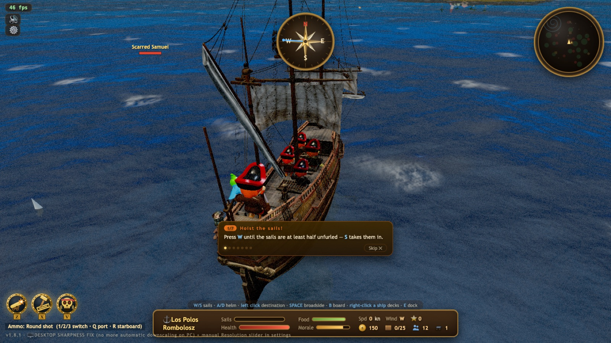
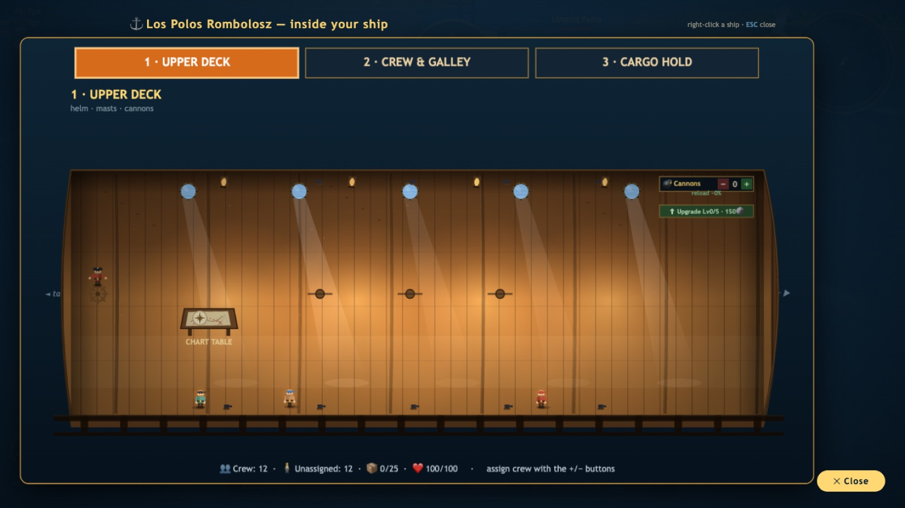
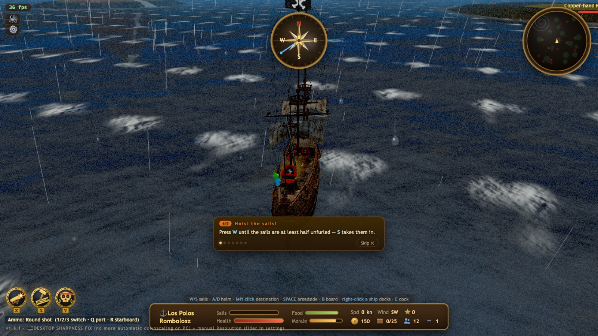

# LOS POLOS KALÓZOK / PIRATES

A **3D pirate game that runs in a browser tab**. Sail with the wind, trade between ports, fire
broadsides, board what is left, and go looking for the Kraken at the edge of the map.

No engine, no framework, **no build step**: Three.js r128 and a **single 4 300-line `index.html`**.

**▶ Play it now — [English](https://skynet.lospolo.hu/kalozok/?lang=en) · [Magyarul](https://skynet.lospolo.hu/kalozok/)**

[](https://discord.gg/sBfBdB8AzK)

<sub>Also mirrored on GitHub Pages: [lospolosadwords-dev.github.io/kalozok](https://lospolosadwords-dev.github.io/kalozok/) — everything works there except multiplayer, which needs PHP.</sub>



---

## What's in it

| | |
|---|---|
| **The sea** | Deterministic seeded world — organic islands, photogrammetry rock mountains, whirlpools, a waterfall at the edge of the flat earth. Four sectors that unlock with reputation: calmer and poorer, or richer and deadlier. |
| **Sky** | A full day/night cycle (~7 min), moon and 1 100 stars, storms with rain, lightning and heavy seas, fog, and an underwater view when you go under. |
| **Sailing** | Wind direction and sail trim actually matter, the hull heels into turns, wakes and bow spray, and you can run aground. |
| **Combat** | Left and right broadsides, three ammo types (round · chain · grapeshot), boarding, telegraphed enemy salvos, crew casualties, three captain abilities on cooldown. |
| **Your ship** | An **FTL-style 3-deck cutaway**: station crew at the cannons, the sails or the pumps for live modifiers, watch fires and leaks spread deck by deck, and upgrade each deck separately. |
| **Trade** | Port specialities, prices that move when you buy and sell and drift back over time, ship tiers (raft → brig → galley → ship of the line), an upgrade tree, reputation and ranks. |
| **Content** | Treasure maps and digging, hunt / escort / smuggling missions, a tavern where you hire officers, a sea serpent, a ghost ship, the Kraken, and a two-phase campaign — *The Last Pirate*. |
| **Cosmetics** | 6 hull paints, 5 sail patterns, figureheads and a ship name — a dark paint job genuinely makes the AI spot you later. |
| **Multiplayer** | 2–8 players over a plain PHP short-poll relay: lobby, chat, shared seed so everyone sails the same sea, host-simulated bots, PvP or co-op — including a co-op Kraken fight. |
| **Also** | Bilingual (English / Hungarian), a guided 7-step tutorial, mobile joystick and touch controls, adaptive resolution, and saves in `localStorage`. |

<p align="center">
  
  
</p>

## Running it

There is nothing to compile:

```bash
git clone https://github.com/lospolosadwords-dev/kalozok.git
cd kalozok
python3 -m http.server 8188     # or: php -S 127.0.0.1:8188
```

Then open <http://127.0.0.1:8188/>. Add `?lang=en` for English.

Three.js itself is loaded from a CDN (`cdnjs.cloudflare.com`), so the first load needs a network
connection; everything else is local.

**Multiplayer** is the one part that wants a server: `mp.php` is plain PHP 5.6-compatible code with
file-backed rooms in `mp_rooms/`, so `php -S` is enough. See [MULTIPLAYER.md](MULTIPLAYER.md).

## How it is put together

```
index.html      the whole game — world gen, rendering, AI, combat, economy, UI, multiplayer client
lib/            Three.js r128 example modules (Water, Sky, GLTFLoader, post-processing chain)
assets/         CC0 models and textures — see ASSETS.md
mp.php          multiplayer relay (no database, no persistent process)
tools/          headless screenshot + smoke-test harness, and the public-release sync script
```

[ARCHITECTURE.md](ARCHITECTURE.md) is the map: key functions, the debug URL parameters, and the
handful of places where a well-meaning change will quietly break the game.

## Controls

`W`/`S` sails · `A`/`D` rudder · `Space` full broadside · `Q`/`R` left / right broadside ·
`1` `2` `3` ammo · `E` dock · `B` board · `G` dig · `Z` `X` `V` captain abilities ·
right click the ship for the deck view · `O` settings · `T` chat in multiplayer.

On a phone: virtual joystick, plus fire / dock / ammo / action / deck buttons.

## Licence

Code **MIT** ([LICENSE](LICENSE)). Bundled art and audio are **CC0** — the full source list is in
[ASSETS.md](ASSETS.md), third-party notices in [NOTICE.md](NOTICE.md).

## Differences from the build we run

The public build has no `upload.php` (an internal uploader that let us add our own faces as pirate
portraits) and no photo-to-name mapping, so every captain gets one of the eight AI-drawn portraits.
Nothing else is held back.

---

Made by **Los Polos Amigos Kft.** — a Hungarian print shop that keeps writing games between orders.
Our other open-source games: [BIRODALMAK](https://github.com/lospolosadwords-dev/birodalmak) (4X
strategy) and [Squeak & Destroy](https://github.com/lospolosadwords-dev/squeak-and-destroy)
(turn-based artillery).
